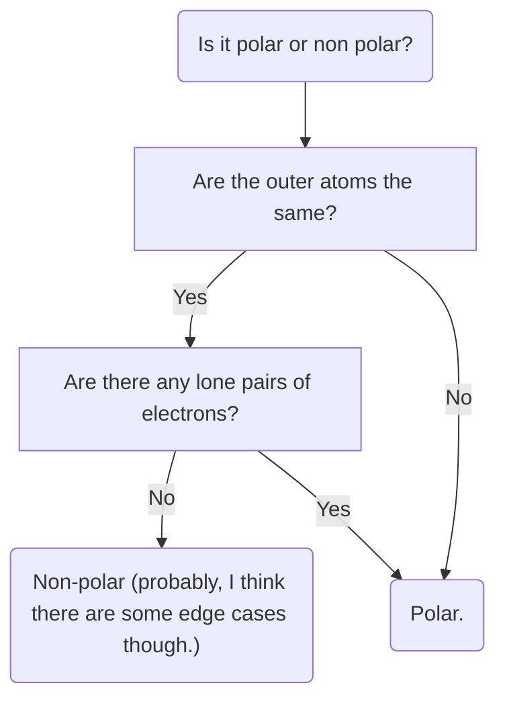

# Electronegativity

```mermaid
graph TD;
	A(Is it polar or non polar?)-->B
	B[Are the outer atoms the same?]-->|Yes| C;
	B-->|No| D;
	C[Are there any lone pairs of electrons?]-->|No| E;
	C-->|Yes| D;
	D(Polar.);
	E("Non-polar (probably, I think there are some edge cases though.)");
```
[[Flowcharts]]

![[Pasted image 20220321210213.png]] Thank you wikipedia.