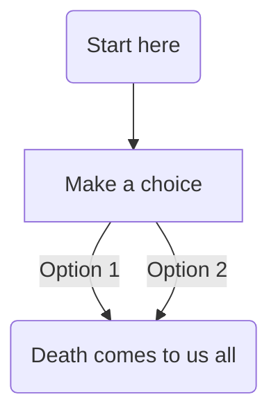
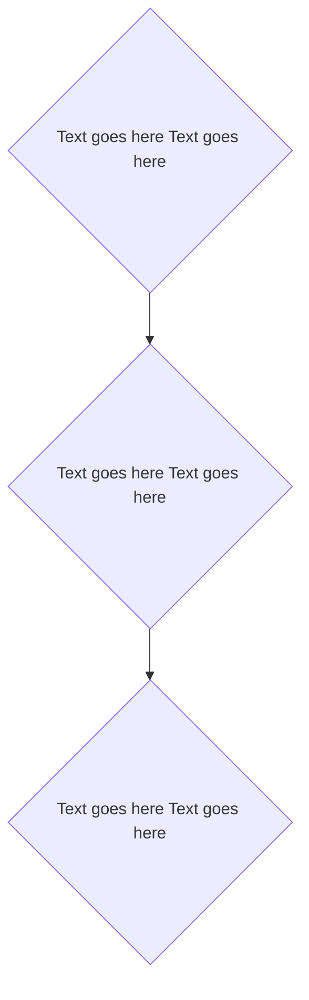

# Flowcharts
For flowchats, I'll use square boxes for descions and rounded boxes for everything else.

Why? Becuase the diamon shapes (which apprently are meant to be used for descions) are really big and make it hard to see the whole flowchar on one screen. 
